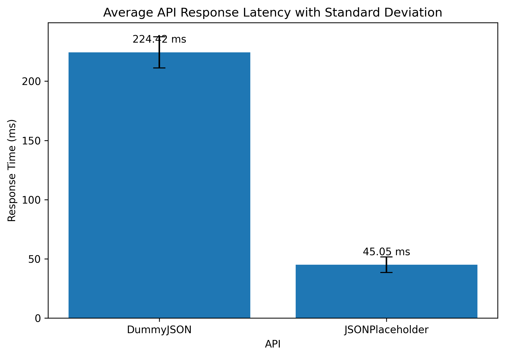

# API Response Benchmark

A small reproducible benchmark comparing the response latency and reliability of two public REST APIs:

- JSONPlaceholder
- DummyJSON

## Objective

The purpose of this experiment was to compare API response performance using repeated HTTP requests and determine whether there was a measurable difference in latency and reliability between the two services.

## Method

Each API was tested using 30 HTTP GET requests.

To reduce timing bias, requests were interleaved between the two APIs rather than completing all requests for one API before testing the other.

For every request, the following information was recorded:

- Response latency in milliseconds
- HTTP status code
- Request success or failure

The benchmark was conducted using Python in Google Colab.

## Results

| Metric | JSONPlaceholder | DummyJSON |
| --- | ---: | ---: |
| Average latency | 45.20 ms | 221.53 ms |
| Median latency | 43.81 ms | 217.88 ms |
| Minimum latency | 37.01 ms | 203.59 ms |
| Maximum latency | 73.43 ms | 248.37 ms |
| Standard deviation | 6.08 ms | 14.46 ms |
| Successful requests | 30/30 | 30/30 |
| Success rate | 100% | 100% |

In this benchmark environment, JSONPlaceholder achieved substantially lower response latency than DummyJSON.

Its average response time was approximately 4.9 times faster.

Both APIs successfully completed all 30 requests.

JSONPlaceholder also showed lower absolute latency variation, although the results should not be interpreted as evidence that one API will always outperform the other under different network, server, geographic, or workload conditions.

## Visualization

## Reproducing the Benchmark

The analysis notebook is available in:

`api_response_benchmark.ipynb`

To reproduce the experiment:

1. Open the notebook in Google Colab or Jupyter Notebook.
2. Run all cells.
3. The script sends repeated requests to both APIs.
4. Raw request measurements are stored in `raw_results.csv`.
5. Summary statistics are stored in `summary_results.csv`.

## Tools

- Python
- Requests
- Pandas
- Matplotlib
- Google Colab

## Files

`api_response_benchmark.ipynb`  
Contains the benchmark code and analysis.

`raw_results.csv`  
Contains individual request latency measurements and HTTP response information.

`summary_results.csv`  
Contains aggregated benchmark statistics.

`api_latency_with_std.png`  
Visual comparison of average response latency with standard deviation.

## Limitations

This is a small benchmark conducted from a single Google Colab environment.

API response time can be affected by:

- Network routing
- Server load
- Geographic location
- Caching
- Internet conditions
- Time of testing

The results therefore describe the observed performance during this experiment rather than universal API performance.

## Author

PenguinLogic
